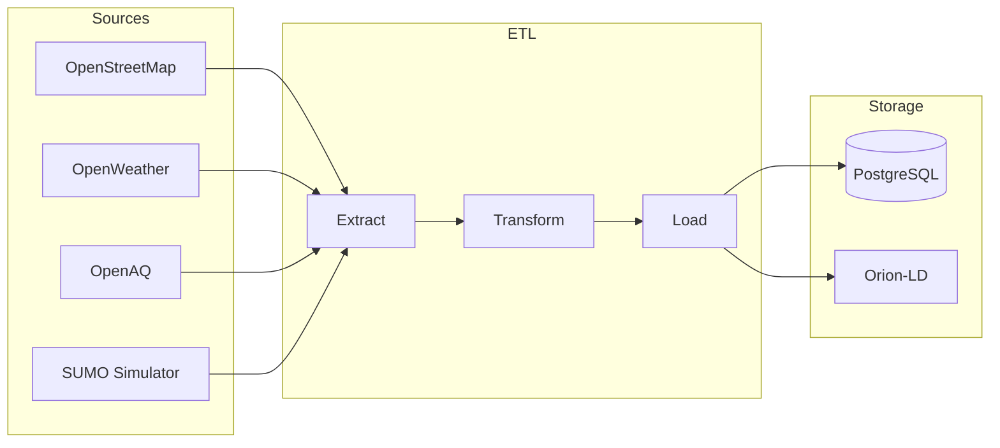

<!-- /*Copyright 2025 HouHackathon-CQP

 Licensed under the Apache License, Version 2.0 (the "License");
 you may not use this file except in compliance with the License.
 You may obtain a copy of the License at

     http://www.apache.org/licenses/LICENSE-2.0

 Unless required by applicable law or agreed to in writing, software
 distributed under the License is distributed on an "AS IS" BASIS,
 WITHOUT WARRANTIES OR CONDITIONS OF ANY KIND, either express or implied.
 See the License for the specific language governing permissions and
 limitations under the License. */ -->

# Data Pipeline

<div class="badge badge-primary">Python</div>
<div class="badge badge-primary">GeoJSON</div>
<div class="badge badge-primary">SUMO</div>
<div class="badge badge-secondary">ETL</div>

## Tổng Quan

Data Pipeline của GreenMap xử lý dữ liệu từ nhiều nguồn khác nhau và chuẩn hóa về định dạng thống nhất.



## Thu Thập Dữ Liệu OSM

### Overpass API Query

```python
import requests

# Bounding box Hà Nội
BBOX = (20.57, 105.28, 21.39, 106.02)

def query_osm(element_type, tags):
    """Query OSM via Overpass API"""
    query = f"""
    [out:json][timeout:60];
    (
        node["{tags}"]{BBOX};
        way["{tags}"]{BBOX};
    );
    out center;
    """
    
    response = requests.post(
        "https://overpass-api.de/api/interpreter",
        data={"data": query}
    )
    return response.json()
```

### Chuyển Đổi Sang GeoJSON

```python
def osm_to_geojson(osm_data):
    """Convert OSM data to GeoJSON format"""
    features = []
    
    for element in osm_data.get("elements", []):
        if element["type"] == "node":
            geometry = {
                "type": "Point",
                "coordinates": [element["lon"], element["lat"]]
            }
        elif element["type"] == "way" and "center" in element:
            geometry = {
                "type": "Point",
                "coordinates": [element["center"]["lon"], element["center"]["lat"]]
            }
        else:
            continue
            
        feature = {
            "type": "Feature",
            "properties": element.get("tags", {}),
            "geometry": geometry
        }
        features.append(feature)
    
    return {
        "type": "FeatureCollection",
        "features": features
    }
```

## SUMO Traffic Simulation

### Cấu Trúc Dữ Liệu

```json
{
  "timestamp": "2025-12-10T14:30:00Z",
  "vehicles": [
    {
      "id": "veh_001",
      "type": "car",
      "position": [105.8542, 21.0285],
      "speed": 35.5,
      "heading": 90,
      "emissions": {
        "CO2": 0.15,
        "NOx": 0.02
      }
    }
  ],
  "road_segments": [
    {
      "id": "edge_abc",
      "density": 0.75,
      "average_speed": 28.3,
      "congestion_level": "moderate"
    }
  ]
}
```

### Processing Script

```python
# process_simulation.py

import json
from datetime import datetime

def process_simulation_file(file_path):
    """Process SUMO simulation output"""
    with open(file_path, 'r') as f:
        data = json.load(f)
    
    # Aggregate traffic data
    traffic_entities = []
    for segment in data.get("road_segments", []):
        entity = {
            "id": f"urn:ngsi-ld:TrafficFlow:{segment['id']}",
            "type": "TrafficFlow",
            "density": {
                "type": "Property",
                "value": segment["density"]
            },
            "averageSpeed": {
                "type": "Property",
                "value": segment["average_speed"],
                "unitCode": "KMH"
            },
            "congestionLevel": {
                "type": "Property",
                "value": segment["congestion_level"]
            },
            "dateObserved": {
                "type": "Property",
                "value": datetime.utcnow().isoformat()
            }
        }
        traffic_entities.append(entity)
    
    return traffic_entities
```

## NGSI-LD Entity Format

### AirQualityObserved

```json
{
  "id": "urn:ngsi-ld:AirQualityObserved:HN-001",
  "type": "AirQualityObserved",
  "@context": [
    "https://raw.githubusercontent.com/smart-data-models/dataModel.Environment/master/context.jsonld"
  ],
  "location": {
    "type": "GeoProperty",
    "value": {
      "type": "Point",
      "coordinates": [105.8542, 21.0285]
    }
  },
  "airQualityIndex": {
    "type": "Property",
    "value": 85
  },
  "PM2.5": {
    "type": "Property",
    "value": 35.2,
    "unitCode": "GQ"
  },
  "PM10": {
    "type": "Property",
    "value": 58.1,
    "unitCode": "GQ"
  },
  "dateObserved": {
    "type": "Property",
    "value": "2025-12-10T14:30:00Z"
  }
}
```

## Utility Scripts

### merge_json.py

```python
"""Merge multiple JSON files into one"""
import json
import glob

def merge_json_files(pattern, output_file):
    merged_data = []
    
    for file_path in glob.glob(pattern):
        with open(file_path, 'r') as f:
            data = json.load(f)
            if isinstance(data, list):
                merged_data.extend(data)
            else:
                merged_data.append(data)
    
    with open(output_file, 'w') as f:
        json.dump(merged_data, f, indent=2)
    
    print(f"Merged {len(merged_data)} records to {output_file}")
```

### split_json.py

```python
"""Split large JSON file into smaller parts"""
import json
import math

def split_json_file(input_file, chunk_size=1000):
    with open(input_file, 'r') as f:
        data = json.load(f)
    
    num_chunks = math.ceil(len(data) / chunk_size)
    
    for i in range(num_chunks):
        chunk = data[i * chunk_size : (i + 1) * chunk_size]
        output_file = f"{input_file.replace('.json', '')}_part{i+1}.json"
        
        with open(output_file, 'w') as f:
            json.dump(chunk, f, indent=2)
        
        print(f"Created {output_file} with {len(chunk)} records")
```
