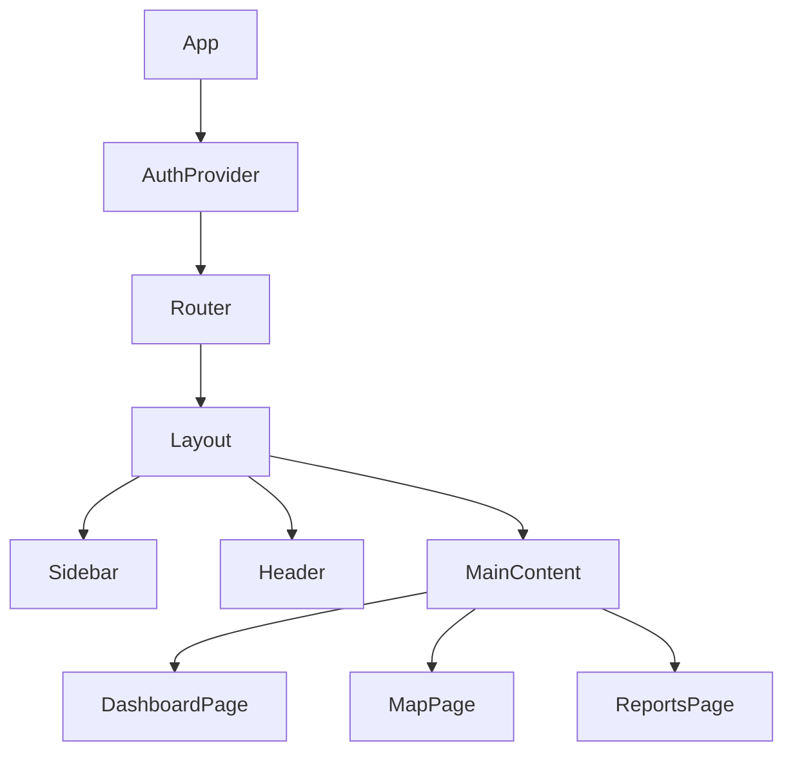

<!-- /*Copyright 2025 HouHackathon-CQP

 Licensed under the Apache License, Version 2.0 (the "License");
 you may not use this file except in compliance with the License.
 You may obtain a copy of the License at

     http://www.apache.org/licenses/LICENSE-2.0

 Unless required by applicable law or agreed to in writing, software
 distributed under the License is distributed on an "AS IS" BASIS,
 WITHOUT WARRANTIES OR CONDITIONS OF ANY KIND, either express or implied.
 See the License for the specific language governing permissions and
 limitations under the License. */ -->

# Frontend Portal

<div class="badge badge-primary">React 18</div>
<div class="badge badge-primary">Vite 5</div>
<div class="badge badge-primary">MapLibre GL</div>
<div class="badge badge-secondary">TailwindCSS</div>

## Cấu Trúc Dự Án

```
src/
├── apiService.js       # Axios configuration & API calls
├── App.jsx             # Root component with routing
├── main.jsx            # Entry point
├── index.css           # Global styles (Tailwind)
├── components/         # Reusable UI components
│   ├── common/         # Buttons, Inputs, Modals
│   ├── dashboard/      # Dashboard widgets
│   ├── map/            # Map components
│   └── layout/         # Sidebar, Header
├── context/            # React Context providers
│   ├── AuthContext.jsx # Authentication state
│   └── MapContext.jsx  # Map state & filters
├── pages/              # Page components
│   ├── Dashboard.jsx
│   ├── MapView.jsx
│   ├── Reports.jsx
│   └── Login.jsx
└── utils/              # Helper functions
    ├── formatDate.js
    └── aqiColors.js
```

## Component Architecture



## State Management

Sử dụng **React Context API** cho global state:

### AuthContext

```jsx
const AuthContext = createContext();

export function AuthProvider({ children }) {
  const [user, setUser] = useState(null);
  const [token, setToken] = useState(localStorage.getItem('token'));

  const login = async (email, password) => {
    const response = await api.login(email, password);
    setToken(response.access_token);
    localStorage.setItem('token', response.access_token);
  };

  const logout = () => {
    setToken(null);
    localStorage.removeItem('token');
  };

  return (
    <AuthContext.Provider value={{ user, token, login, logout }}>
      {children}
    </AuthContext.Provider>
  );
}
```

### MapContext

```jsx
const MapContext = createContext();

export function MapProvider({ children }) {
  const [activeLayer, setActiveLayer] = useState('AQI');
  const [filters, setFilters] = useState({
    radius: 5, // km
    center: [105.8542, 21.0285] // Hanoi
  });

  return (
    <MapContext.Provider value={{ activeLayer, setActiveLayer, filters, setFilters }}>
      {children}
    </MapContext.Provider>
  );
}
```

## MapLibre Integration

### Basic Map Setup

```jsx
import maplibregl from 'maplibre-gl';

function MapView() {
  const mapContainer = useRef(null);
  const map = useRef(null);

  useEffect(() => {
    if (map.current) return;

    map.current = new maplibregl.Map({
      container: mapContainer.current,
      style: `https://api.maptiler.com/maps/streets/style.json?key=${MAPTILER_KEY}`,
      center: [105.8542, 21.0285],
      zoom: 12,
      pitch: 45 // 3D view
    });

    map.current.addControl(new maplibregl.NavigationControl());
  }, []);

  return <div ref={mapContainer} className="w-full h-full" />;
}
```

### Adding Markers

```jsx
function addMarker(map, coordinates, color) {
  new maplibregl.Marker({ color })
    .setLngLat(coordinates)
    .setPopup(new maplibregl.Popup().setHTML('<h3>Station Info</h3>'))
    .addTo(map);
}
```

## API Service

```javascript
// apiService.js
import axios from 'axios';

const api = axios.create({
  baseURL: import.meta.env.VITE_API_URL,
  headers: {
    'Content-Type': 'application/json'
  }
});

// Request interceptor - Add token
api.interceptors.request.use((config) => {
  const token = localStorage.getItem('token');
  if (token) {
    config.headers.Authorization = `Bearer ${token}`;
  }
  return config;
});

export const reportService = {
  getAll: (params) => api.get('/reports/', { params }),
  create: (data) => api.post('/reports/', data),
  update: (id, data) => api.put(`/reports/${id}`, data)
};
```

## Styling với TailwindCSS

### Ví dụ Component

```jsx
function Button({ children, variant = 'primary', ...props }) {
  const baseClasses = 'px-4 py-2 rounded-lg font-medium transition-colors';
  const variants = {
    primary: 'bg-teal-500 text-white hover:bg-teal-600',
    secondary: 'bg-gray-200 text-gray-800 hover:bg-gray-300',
    danger: 'bg-red-500 text-white hover:bg-red-600'
  };

  return (
    <button className={`${baseClasses} ${variants[variant]}`} {...props}>
      {children}
    </button>
  );
}
```

## Build & Deploy

```bash
# Development
npm run dev

# Production build
npm run build

# Preview production build
npm run preview
```

Build output sẽ nằm trong thư mục `dist/`.
