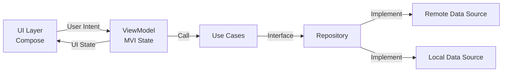

<!-- /*Copyright 2025 HouHackathon-CQP

 Licensed under the Apache License, Version 2.0 (the "License");
 you may not use this file except in compliance with the License.
 You may obtain a copy of the License at

     http://www.apache.org/licenses/LICENSE-2.0

 Unless required by applicable law or agreed to in writing, software
 distributed under the License is distributed on an "AS IS" BASIS,
 WITHOUT WARRANTIES OR CONDITIONS OF ANY KIND, either express or implied.
 See the License for the specific language governing permissions and
 limitations under the License. */ -->

# Mobile App

<div class="badge badge-primary">Kotlin</div>
<div class="badge badge-primary">Jetpack Compose</div>
<div class="badge badge-primary">MapLibre SDK</div>
<div class="badge badge-secondary">MVI Architecture</div>

## Kiến Trúc MVI

Ứng dụng sử dụng kiến trúc **MVI (Model-View-Intent)** kết hợp **Clean Architecture**:



### Cấu Trúc Thư Mục

```
app/src/main/java/com/houhackathon/greenmap_app/
├── core/                   # Core utilities
│   ├── network/            # Network configuration
│   ├── datastore/          # Local storage
│   └── mvi/                # Base MVI classes
├── data/                   # Data Layer
│   ├── remote/             # API services
│   ├── local/              # Room database
│   └── repository/         # Repository implementations
├── domain/                 # Domain Layer
│   ├── model/              # Domain models
│   ├── repository/         # Repository interfaces
│   └── usecase/            # Use cases
├── ui/                     # UI Layer
│   ├── theme/              # Material 3 theme
│   ├── components/         # Reusable composables
│   ├── home/               # Home screen
│   ├── map/                # Map screen
│   ├── report/             # Report screen
│   └── profile/            # Profile screen
├── navigation/             # Navigation setup
└── di/                     # Hilt modules
```

## Base MVI ViewModel

```kotlin
abstract class BaseMviViewModel<State, Intent>(
    initialState: State
) : ViewModel() {
    
    private val _state = MutableStateFlow(initialState)
    val state: StateFlow<State> = _state.asStateFlow()

    abstract fun handleIntent(intent: Intent)

    protected fun updateState(reducer: State.() -> State) {
        _state.update { it.reducer() }
    }
}
```

## Ví Dụ: Map Screen

### State & Intent

```kotlin
data class MapState(
    val isLoading: Boolean = false,
    val locations: List<Location> = emptyList(),
    val selectedLayer: MapLayer = MapLayer.AQI,
    val error: String? = null
)

sealed class MapIntent {
    data class SelectLayer(val layer: MapLayer) : MapIntent()
    object RefreshData : MapIntent()
    data class SelectLocation(val id: String) : MapIntent()
}
```

### ViewModel

```kotlin
@HiltViewModel
class MapViewModel @Inject constructor(
    private val getLocationsUseCase: GetLocationsUseCase
) : BaseMviViewModel<MapState, MapIntent>(MapState()) {

    override fun handleIntent(intent: MapIntent) {
        when (intent) {
            is MapIntent.SelectLayer -> selectLayer(intent.layer)
            is MapIntent.RefreshData -> loadData()
            is MapIntent.SelectLocation -> selectLocation(intent.id)
        }
    }

    private fun loadData() {
        viewModelScope.launch {
            updateState { copy(isLoading = true) }
            getLocationsUseCase()
                .onSuccess { locations ->
                    updateState { copy(isLoading = false, locations = locations) }
                }
                .onFailure { error ->
                    updateState { copy(isLoading = false, error = error.message) }
                }
        }
    }
}
```

### Composable Screen

```kotlin
@Composable
fun MapScreen(viewModel: MapViewModel = hiltViewModel()) {
    val state by viewModel.state.collectAsStateWithLifecycle()

    Column(modifier = Modifier.fillMaxSize()) {
        // Layer selector
        LayerSelector(
            selectedLayer = state.selectedLayer,
            onLayerSelected = { viewModel.handleIntent(MapIntent.SelectLayer(it)) }
        )
        
        // Map view
        MapLibreView(
            locations = state.locations,
            modifier = Modifier.weight(1f)
        )
        
        // Loading indicator
        if (state.isLoading) {
            LinearProgressIndicator(modifier = Modifier.fillMaxWidth())
        }
    }
}
```

## MapLibre Integration

```kotlin
@Composable
fun MapLibreView(
    locations: List<Location>,
    modifier: Modifier = Modifier
) {
    AndroidView(
        modifier = modifier,
        factory = { context ->
            MapView(context).apply {
                getMapAsync { map ->
                    map.setStyle(styleUrl) {
                        // Add markers
                        locations.forEach { location ->
                            map.addMarker(MarkerOptions()
                                .position(LatLng(location.lat, location.lng))
                                .title(location.name)
                            )
                        }
                    }
                }
            }
        }
    )
}
```

## Dependency Injection (Hilt)

```kotlin
@Module
@InstallIn(SingletonComponent::class)
object NetworkModule {
    
    @Provides
    @Singleton
    fun provideOkHttpClient(): OkHttpClient {
        return OkHttpClient.Builder()
            .addInterceptor(AuthInterceptor())
            .build()
    }
    
    @Provides
    @Singleton
    fun provideRetrofit(client: OkHttpClient): Retrofit {
        return Retrofit.Builder()
            .baseUrl(BuildConfig.API_BASE_URL)
            .client(client)
            .addConverterFactory(GsonConverterFactory.create())
            .build()
    }
}
```

## Build Variants

```kotlin
// build.gradle.kts
android {
    buildTypes {
        debug {
            isMinifyEnabled = false
            buildConfigField("String", "API_BASE_URL", "\"http://10.0.2.2:8000/\"")
        }
        release {
            isMinifyEnabled = true
            buildConfigField("String", "API_BASE_URL", "\"https://api.greenmap.hanoi/\"")
        }
    }
}
```
