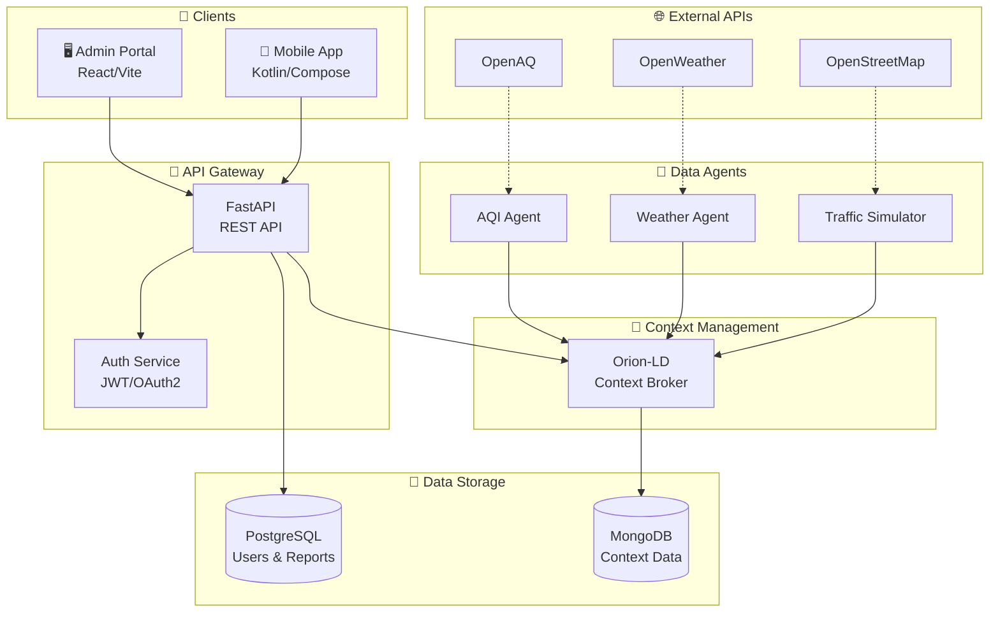
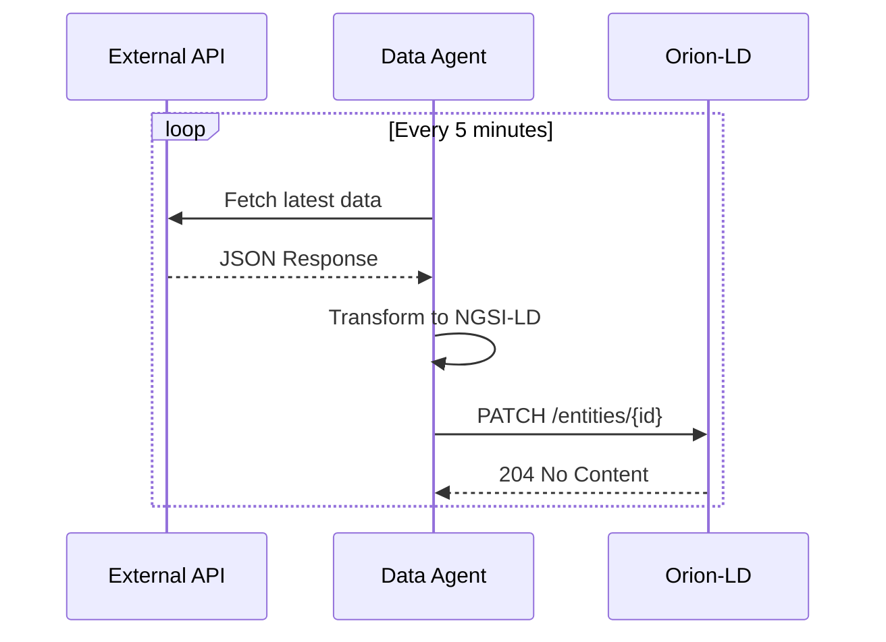

<!-- /*Copyright 2025 HouHackathon-CQP

 Licensed under the Apache License, Version 2.0 (the "License");
 you may not use this file except in compliance with the License.
 You may obtain a copy of the License at

     http://www.apache.org/licenses/LICENSE-2.0

 Unless required by applicable law or agreed to in writing, software
 distributed under the License is distributed on an "AS IS" BASIS,
 WITHOUT WARRANTIES OR CONDITIONS OF ANY KIND, either express or implied.
 See the License for the specific language governing permissions and
 limitations under the License. */ -->

# Kiến Trúc Tổng Quan

GreenMap được thiết kế theo kiến trúc **Microservices Hybrid** kết hợp với **Event-Driven Architecture**, lấy **Context Broker** làm trung tâm quản lý dữ liệu ngữ cảnh.

## Sơ Đồ Kiến Trúc



## Các Thành Phần

### 1. Clients (Giao diện người dùng)

| Thành phần | Công nghệ | Đối tượng |
|------------|-----------|-----------|
| **Admin Portal** | React, Vite, MapLibre | Quản trị viên |
| **Mobile App** | Kotlin, Jetpack Compose | Người dân |

### 2. API Gateway

**FastAPI** đóng vai trò là gateway chính:

- **Authentication**: Xác thực JWT, quản lý session
- **Authorization**: Phân quyền RBAC (Admin/Citizen)
- **Routing**: Điều hướng request đến service phù hợp
- **Rate Limiting**: Giới hạn số lượng request

### 3. Context Broker (Orion-LD)

Trái tim của hệ thống, quản lý dữ liệu ngữ cảnh theo chuẩn **NGSI-LD**:

- **Entities**: Lưu trữ trạng thái hiện tại của các đối tượng
- **Subscriptions**: Đăng ký nhận thông báo khi dữ liệu thay đổi
- **Geo-queries**: Truy vấn dựa trên vị trí địa lý
- **Temporal**: Lưu trữ lịch sử thay đổi

### 4. Data Agents

Các service chạy nền thu thập dữ liệu:



## Luồng Dữ Liệu

### 1. Đọc Dữ Liệu (Read Flow)

```
Client → API Gateway → Context Broker → Response
```

### 2. Ghi Dữ Liệu (Write Flow)

```
Agent → Transform → Context Broker → MongoDB
```

### 3. Báo Cáo Sự Cố (Report Flow)

```
Mobile App → API Gateway → PostgreSQL → Admin Portal
```

## Tiêu Chuẩn Áp Dụng

- **NGSI-LD**: Chuẩn dữ liệu ngữ cảnh cho IoT
- **JSON-LD**: Linked Data trong JSON
- **GeoJSON**: Dữ liệu địa lý
- **OpenAPI 3.0**: Tài liệu REST API
- **OAuth2**: Xác thực và phân quyền
