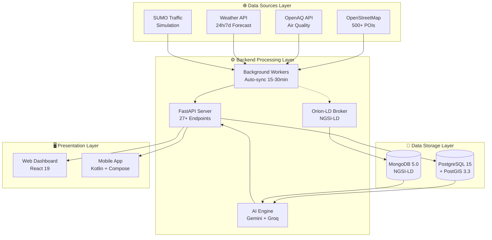

# 🌿 GreenMap - Nền Tảng Bản Đồ Xanh Thông Minh

<div align="center">
  
  <p><strong>"Công nghệ kết nối cộng đồng vì một Hà Nội trong lành"</strong></p>
</div>

---

Chào mừng đến với tài liệu chính thức của **GreenMap Hanoi** - Hệ sinh thái công nghệ kết hợp AI, IoT và dữ liệu mở để giải quyết bài toán ô nhiễm môi trường tại Hà Nội.

## 💡 GreenMap là gì?

**GreenMap Hanoi** không chỉ là một ứng dụng bản đồ - đây là nền tảng tích hợp toàn diện với **3 trụ cột chính**:

### 🔍 Giám Sát Real-time
- Theo dõi chỉ số AQI (PM2.5, PM10, NO2, O3, CO, SO2) theo từng khu vực
- Dự báo thời tiết 24h/7 ngày (nhiệt độ, độ ẩm, lượng mưa, gió)
- **AI Insights** với Google Gemini & Groq phân tích và đưa ra lời khuyên
- Giám sát mật độ giao thông real-time từ SUMO simulation
- Cập nhật tự động mỗi 15-30 phút

### 🌱 Hạ Tầng Xanh
- Bản đồ **500+ điểm POI** (công viên, trạm sạc EV, xe đạp công cộng, du lịch)
- Dữ liệu GeoJSON từ OpenStreetMap
- Tìm kiếm điểm xanh gần nhất theo GPS
- Thông tin chi tiết: trạng thái, giờ mở cửa, tiện ích

### 👥 Cộng Đồng Tham Gia
- Báo cáo điểm ô nhiễm với upload ảnh hiện trường
- Hệ thống duyệt báo cáo từ admin
- Chia sẻ thông tin môi trường
- RSS feed tin tức xanh từ báo Hà Nội Mới

## ⚡ Tính Năng Nổi Bật

### 🎯 Cho Người Dùng Cuối (Mobile App)

| Tính Năng | Mô Tả | Công Nghệ |
|-----------|-------|-----------|
| 🌫️ **AQI Real-time** | Chất lượng không khí theo GPS location | OpenAQ API |
| 🌤️ **Dự Báo Thời Tiết** | Cập nhật mỗi 15 phút | Weather API |
| 🤖 **AI Insights** | Phân tích bằng Gemini/Groq, lời khuyên tiếng Việt | Google AI / Groq |
| 🚗 **Traffic Monitor** | Mật độ giao thông real-time | SUMO Simulation |
| ⚡ **EV Charging** | 100+ trạm sạc + trạng thái | OSM + PostGIS |
| 🚴 **Bike Sharing** | 50+ điểm thuê xe đạp công cộng | GeoJSON |
| 🏞️ **Điểm Xanh** | 200+ công viên, 150+ du lịch | MapLibre GL JS |
| 📢 **Community Report** | Upload ảnh + GPS location | FastAPI + PostgreSQL |

### 💼 Cho Quản Trị Viên (Web Dashboard)

| Tính Năng | Mô Tả | Công Nghệ |
|-----------|-------|-----------|
| 📊 **KPI Dashboard** | Tổng quan: sensors, users, reports, alerts | Recharts + React |
| 🗺️ **7-Layer Map** | AQI, Weather, Traffic, EV, Bike, Park, Report | MapLibre GL JS |
| 📈 **Analytics** | Biểu đồ AQI theo quận, trends, heatmap | D3.js + Turf.js |
| 🤖 **AI Analytics** | Lịch sử phân tích, context data, insights | PostgreSQL |
| ✅ **Report Management** | Duyệt/từ chối báo cáo cộng đồng | FastAPI CRUD |
| 👥 **User Management** | ADMIN/CITIZEN roles, JWT auth | SQLAlchemy |
| 🌳 **Green Infrastructure** | CRUD POIs (parks, EV, bikes, tourism) | PostGIS queries |

## 🏗️ Kiến Trúc Hệ Thống

GreenMap được xây dựng theo mô hình **Hybrid Architecture** với 4 tầng rõ ràng:



### 🔑 Điểm Độc Đáo

#### 1. Dual Storage Strategy
- **PostgreSQL + PostGIS**: Dữ liệu tĩnh (users, locations, reports) với truy vấn không gian mạnh mẽ
- **MongoDB via Orion-LD**: Dữ liệu động (AQI, weather, traffic) theo chuẩn NGSI-LD quốc tế

#### 2. FIWARE NGSI-LD Context Broker
- **Orion-LD 1.6.1**: Chuẩn mực toàn cầu cho Smart Cities
- Plug-and-play với IoT sensors
- Real-time data streaming & subscriptions
- Interoperability với các hệ thống thông minh khác

#### 3. AI-Powered Analysis
- **Google Gemini API** (primary): Phân tích thông minh, đa ngôn ngữ
- **Groq API** (fallback): Auto-switch khi Gemini quá tải
- Phân tích weather + AQI 24h/7 ngày
- Đưa ra lời khuyên cá nhân hóa bằng tiếng Việt

#### 4. Background Processing
- **AQI Agent**: Auto-sync mỗi 30 phút
- **Weather Agent**: Auto-sync mỗi 15 phút
- Python AsyncIO + APScheduler
- Retry mechanism & error handling

## 📦 Cấu Trúc Dự Án

GreenMap bao gồm **4 repositories chính**:

### 🔧 [GreenMap-Backend](https://github.com/HouHackathon-CQP/GreenMap-Backend)
**Core API & Data Processing Engine**

- **Tech Stack**: FastAPI 0.104+, Python 3.10+, PostgreSQL 15, MongoDB 5.0
- **Features**: 27+ REST API endpoints, JWT auth, CRUD operations, AI integration
- **Workers**: AQI Agent (30min), Weather Agent (15min)
- **AI**: Google Gemini API + Groq API (fallback)
- **Status**: ✅ Production Ready

### 🎨 [GreenMap-Frontend](https://github.com/HouHackathon-CQP/GreenMap-Frontend)
**Admin Dashboard & Analytics Platform**

- **Tech Stack**: React 19, TypeScript 5.3, Vite 7.2, TailwindCSS 3.4
- **Features**: 7-layer map, KPI dashboard, report management, user admin
- **Mapping**: MapLibre GL JS 5.13, Turf.js 7.3
- **Charts**: Recharts 3.4, D3.js
- **Status**: ✅ Production Ready

### 📱 [GreenMap-Mobile-App](https://github.com/HouHackathon-CQP/GreenMap-Mobile-App)
**Citizen Mobile Application**

- **Tech Stack**: Kotlin 1.9+, Jetpack Compose BOM 2024, Material 3
- **Architecture**: MVI Pattern, Hilt DI, Coroutines + Flow
- **Features**: Real-time AQI, weather, traffic, green POIs, community reports
- **Mapping**: MapLibre SDK, offline maps
- **Status**: 🚧 Active Development

### 📊 [GreenMap-Data](https://github.com/HouHackathon-CQP/GreenMap-Data)
**Open Dataset & Processing Scripts**

- **Tech Stack**: Python, Jupyter Notebook, Pandas, GeoPandas
- **Datasets**: 500+ POIs (parks, EV, bikes, tourism), traffic simulation
- **Format**: GeoJSON, JSON
- **Status**: ✅ Open Data

## 🛠️ Tech Stack Tổng Quan

### Backend Technologies
```python
# Core Framework
FastAPI 0.104+          # Modern async web framework
Python 3.10+            # Type hints, async/await
SQLAlchemy 2.0          # ORM with async support
Pydantic 2.0            # Data validation

# Databases
PostgreSQL 15           # Relational DB
PostGIS 3.3             # Spatial extensions
MongoDB 5.0             # Document store
Orion-LD 1.6.1          # NGSI-LD Context Broker

# AI & Machine Learning
Google Gemini API       # Primary AI provider
Groq API                # Fallback AI provider
httpx                   # Async HTTP client

# Libraries
geoalchemy2             # PostGIS integration
shapely                 # Geometric operations
python-jose             # JWT tokens
bcrypt                  # Password hashing
```

### Frontend Technologies
```javascript
// Core Framework
React 19                // Latest React features
TypeScript 5.3          // Type safety
Vite 7.2                // Build tool

// UI & Styling
TailwindCSS 3.4         /* Utility-first CSS */
Lucide React            /* Icons */
Tailwind Animate        /* Animations */

// Mapping & Visualization
MapLibre GL JS 5.13     // 3D maps
Recharts 3.4            // Charts
Turf.js 7.3             // Geospatial analysis
```

### Mobile Technologies
```kotlin
// Core
Kotlin 1.9+                     // Modern Android
Jetpack Compose BOM 2024        // Declarative UI
Material 3                      // Design system

// Architecture
MVI Pattern                     // Unidirectional data flow
Hilt                            // Dependency injection
Coroutines + Flow               // Async programming

// Libraries
Retrofit 2.9                    // HTTP client
Room Database                   // Local persistence
MapLibre SDK                    // Map rendering
Coil                            // Image loading
```

## 🚀 Bắt Đầu Nhanh

<div class="grid cards" markdown>

-   :material-rocket-launch:{ .lg .middle } **Cài Đặt Hệ Thống**

    ---

    Thiết lập backend, frontend, mobile và data pipeline

    [:octicons-arrow-right-24: Xem hướng dẫn](getting-started/installation.md)

-   :material-book-open-variant:{ .lg .middle } **Hướng Dẫn Sử Dụng**

    ---

    Tìm hiểu cách sử dụng các tính năng của GreenMap

    [:octicons-arrow-right-24: Khám phá tính năng](user-guide/features.md)

-   :material-api:{ .lg .middle } **Tài Liệu API**

    ---

    Tham khảo 27+ REST API endpoints

    [:octicons-arrow-right-24: Xem API docs](api-reference/endpoints.md)

-   :material-account-group:{ .lg .middle } **Đóng Góp**

    ---

    Tham gia phát triển GreenMap

    [:octicons-arrow-right-24: Hướng dẫn đóng góp](contributing/guidelines.md)

</div>

## 📊 Thống Kê Dự Án

<div class="grid" markdown>

!!! success "Backend"
    - **27+** REST API endpoints
    - **500+** POIs trong database
    - **15-30 phút** auto-sync interval
    - **2** AI providers (Gemini + Groq)

!!! info "Frontend"
    - **7** map layers
    - **5+** chart types
    - **React 19** latest version
    - **100%** TypeScript coverage

!!! tip "Mobile"
    - **Kotlin** 100% native
    - **MVI** architecture
    - **Offline** map support
    - **Material 3** design

!!! warning "Data"
    - **500+** total POIs
    - **200+** parks
    - **100+** EV stations
    - **150+** tourist sites

</div>

## 🌍 Nguồn Dữ Liệu

| Nguồn | Loại Dữ Liệu | Tần Suất | API |
|-------|--------------|----------|-----|
| **OpenStreetMap** | Parks, EV, Bikes, Tourism | One-time | Overpass API |
| **OpenAQ** | PM2.5, PM10, NO2, O3, CO, SO2 | 30 phút | REST API |
| **Weather API** | Temperature, Humidity, Forecast | 15 phút | REST API |
| **SUMO** | Traffic flow, congestion | Simulation | JSON Export |
| **RSS Feed** | Environmental news | Hourly | RSS Parser |
| **Community** | Pollution reports, photos | Real-time | Upload |

## 📄 Giấy Phép

Dự án GreenMap được cấp phép theo **Apache License 2.0**.

```
Copyright 2025 HouHackathon-CQP

Licensed under the Apache License, Version 2.0
```

## 📧 Liên Hệ & Hỗ Trợ

- **Email**: thocodeanhquan@gmail.com
- **GitHub Org**: [@HouHackathon-CQP](https://github.com/HouHackathon-CQP)
- **Issues**: [GitHub Issues](https://github.com/HouHackathon-CQP/GreenMap-Backend/issues)
- **Discussions**: [GitHub Discussions](https://github.com/HouHackathon-CQP/GreenMap-Backend/discussions)

---

<div align="center">
  <p><strong>Code for Hanoi. Code for Life. 🌿</strong></p>
  <p><em>© 2025 GreenMap Hanoi Project. Made with ❤️ in Hanoi.</em></p>
</div>

    [:octicons-arrow-right-24: Quick Start](getting-started/quick-start.md)

-   :material-book-open-page-variant:{ .lg .middle } __Hướng Dẫn Người Dùng__

    ---

    Tìm hiểu tất cả các tính năng

    [:octicons-arrow-right-24: Hướng Dẫn](user-guide/overview.md)

-   :material-api:{ .lg .middle } __Tài Liệu API__

    ---

    Chi tiết API cho developers

    [:octicons-arrow-right-24: API Reference](api-reference/overview.md)

-   :material-heart:{ .lg .middle } __Đóng Góp__

    ---

    Giúp chúng tôi phát triển GreenMap

    [:octicons-arrow-right-24: Contributing](contributing/guidelines.md)

</div>

## Công Nghệ Sử Dụng

### Backend
- **FastAPI**: Framework hiệu năng cao
- **PostgreSQL + GIS**: Hỗ trợ dữ liệu địa lý
- **MongoDB**: Lưu trữ dữ liệu NGSI-LD
- **Orion-LD**: Context Broker
- **SQLAlchemy**: ORM

### Frontend
- **React 19**: UI Framework
- **Vite**: Build tool hiệu quả
- **MapLibre GL JS**: Thư viện bản đồ
- **Tailwind CSS**: Styling
- **Recharts**: Biểu đồ dữ liệu

## Hỗ Trợ & Câu Hỏi

Nếu bạn cần giúp đỡ:

- 📖 [Hướng Dẫn Người Dùng](user-guide/overview.md)
- 🔌 [Tài Liệu API](api-reference/overview.md)
- 🤝 [Hướng Dẫn Đóng Góp](contributing/guidelines.md)
- 📞 Liên hệ: [GitHub Issues](https://github.com/HouHackathon-CQP/GreenMap)

## Về Dự Án

GreenMap được phát triển bởi đội **HouHackathon-CQP** trong HouHackathon. Xem thêm tại [Về GreenMap](about.md)

---

**Let's make our cities greener! 🌍🌱**
