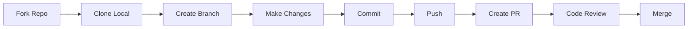

<!-- /*Copyright 2025 HouHackathon-CQP

 Licensed under the Apache License, Version 2.0 (the "License");
 you may not use this file except in compliance with the License.
 You may obtain a copy of the License at

     http://www.apache.org/licenses/LICENSE-2.0

 Unless required by applicable law or agreed to in writing, software
 distributed under the License is distributed on an "AS IS" BASIS,
 WITHOUT WARRANTIES OR CONDITIONS OF ANY KIND, either express or implied.
 See the License for the specific language governing permissions and
 limitations under the License. */ -->

# Hướng Dẫn Đóng Góp

Cảm ơn bạn quan tâm đến việc đóng góp cho GreenMap! Dưới đây là hướng dẫn để bắt đầu.

## Quy Trình Đóng Góp



## Bước Chi Tiết

### 1. Fork Repository

Click nút **Fork** trên GitHub để tạo bản sao về tài khoản của bạn.

### 2. Clone về máy

```bash
git clone https://github.com/YOUR_USERNAME/GreenMap-Backend.git
cd GreenMap-Backend
```

### 3. Tạo Branch mới

```bash
git checkout -b feature/ten-tinh-nang
```

**Quy ước đặt tên branch:**

- `feature/` - Tính năng mới
- `fix/` - Sửa lỗi
- `docs/` - Cập nhật tài liệu
- `refactor/` - Refactor code

### 4. Thực hiện thay đổi

Viết code, test và commit.

### 5. Commit

```bash
git add .
git commit -m "feat(map): add new traffic layer"
```

**Quy ước Commit Message:**

```
<type>(<scope>): <description>

[optional body]
```

**Types:**

| Type | Mô tả |
|------|-------|
| `feat` | Tính năng mới |
| `fix` | Sửa lỗi |
| `docs` | Cập nhật tài liệu |
| `style` | Format code |
| `refactor` | Refactor |
| `test` | Thêm test |
| `chore` | Công việc bảo trì |

### 6. Push và tạo Pull Request

```bash
git push origin feature/ten-tinh-nang
```

Sau đó vào GitHub và tạo Pull Request.

## Code Style

### Python (Backend)

- Tuân thủ **PEP 8**
- Sử dụng **black** để format
- Type hints cho tất cả functions

```bash
# Format code
black app/

# Check linting
flake8 app/
```

### JavaScript/React (Frontend)

- Tuân thủ **Airbnb Style Guide**
- Sử dụng **ESLint** và **Prettier**

```bash
# Lint
npm run lint

# Format
npm run format
```

### Kotlin (Mobile)

- Tuân thủ **Kotlin Coding Conventions**
- Sử dụng **ktlint**

## Code Review Checklist

Khi review PR, chúng tôi kiểm tra:

- [ ] Code tuân thủ style guide
- [ ] Có test cho tính năng mới
- [ ] Không có lỗi lint/compile
- [ ] Tài liệu được cập nhật
- [ ] Commit message đúng format
- [ ] Không có hardcoded secrets

## Code of Conduct

Chúng tôi tuân thủ [Contributor Covenant Code of Conduct](https://www.contributor-covenant.org/).

Tóm tắt:

- 🤝 Tôn trọng lẫn nhau
- 💬 Giao tiếp xây dựng
- 🚫 Không quấy rối
- 🌈 Chào đón mọi đóng góp

## Cần Hỗ Trợ?

- 💬 Mở Discussion trên GitHub
- 📧 Email: contributors@greenmap.hanoi
- 📖 Đọc tài liệu Developer Guide
