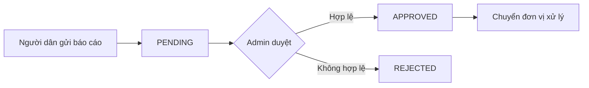

<!-- /*Copyright 2025 HouHackathon-CQP

 Licensed under the Apache License, Version 2.0 (the "License");
 you may not use this file except in compliance with the License.
 You may obtain a copy of the License at

     http://www.apache.org/licenses/LICENSE-2.0

 Unless required by applicable law or agreed to in writing, software
 distributed under the License is distributed on an "AS IS" BASIS,
 WITHOUT WARRANTIES OR CONDITIONS OF ANY KIND, either express or implied.
 See the License for the specific language governing permissions and
 limitations under the License. */ -->

# Quản Lý Báo Cáo

Hệ thống báo cáo cho phép tiếp nhận và xử lý phản ánh từ người dân về các sự cố môi trường.

## Quy Trình Xử Lý



## Giao Diện Quản Lý

### Tabs Trạng Thái

Báo cáo được phân loại theo 3 trạng thái:

| Tab | Trạng thái | Mô tả |
|-----|------------|-------|
| 📋 Chờ xử lý | `PENDING` | Báo cáo mới, chưa được duyệt |
| ✅ Đã duyệt | `APPROVED` | Báo cáo hợp lệ, đã xác nhận |
| ❌ Từ chối | `REJECTED` | Báo cáo spam hoặc không hợp lệ |

### Danh Sách Báo Cáo

Mỗi báo cáo hiển thị:

- **ID**: Mã định danh duy nhất
- **Tiêu đề**: Tóm tắt sự cố
- **Người gửi**: Tên/Email người báo cáo
- **Thời gian**: Ngày giờ tạo báo cáo
- **Vị trí**: Tọa độ GPS

### Chi Tiết Báo Cáo

Click vào một báo cáo để xem chi tiết:

```
┌─────────────────────────────────────────┐
│ Báo cáo #12345                    [X]  │
├─────────────────────────────────────────┤
│ 📷 [Hình ảnh hiện trường]              │
├─────────────────────────────────────────┤
│ Tiêu đề: Rác thải chưa được thu gom    │
│ Mô tả: Bãi rác lớn tại góc đường...    │
│ Vị trí: 21.0285, 105.8542              │
│ Thời gian: 10/12/2025 14:30            │
│ Người gửi: user@example.com            │
├─────────────────────────────────────────┤
│ 🗺️ [Bản đồ vị trí mini]               │
├─────────────────────────────────────────┤
│  [Duyệt]  [Từ chối]                    │
└─────────────────────────────────────────┘
```

## Thao Tác

### Duyệt Báo Cáo

1. Click vào báo cáo trong danh sách `PENDING`
2. Xem xét nội dung và hình ảnh
3. Kiểm tra vị trí trên bản đồ
4. Click **[Duyệt]** nếu hợp lệ

!!! success "Sau khi duyệt"
    - Báo cáo chuyển sang tab `APPROVED`
    - Thông tin được lưu để chuyển đơn vị xử lý
    - Người gửi nhận thông báo (nếu có)

### Từ Chối Báo Cáo

1. Click vào báo cáo trong danh sách `PENDING`
2. Xác định lý do từ chối:
   - Nội dung không rõ ràng
   - Hình ảnh không liên quan
   - Trùng lặp với báo cáo khác
   - Spam hoặc quấy rối
3. Click **[Từ chối]**

### Lọc và Tìm Kiếm

- **Tìm theo ID**: Nhập mã báo cáo
- **Tìm theo từ khóa**: Tìm trong tiêu đề/mô tả
- **Lọc theo thời gian**: Chọn khoảng ngày
- **Lọc theo khu vực**: Chọn quận/huyện

## Phân Loại Sự Cố

Các loại sự cố thường gặp:

| Loại | Icon | Mô tả |
|------|------|-------|
| Rác thải | 🗑️ | Rác chưa thu gom, xả rác bừa bãi |
| Ô nhiễm | 💨 | Khói bụi, mùi hôi, tiếng ồn |
| Cây xanh | 🌳 | Cây đổ, cành gãy, cần tỉa |
| Ngập lụt | 🌊 | Đường ngập, thoát nước kém |
| Hạ tầng | 🏗️ | Đường hư, biển báo hỏng |
| Khác | ❓ | Các sự cố khác |
